R programming Week 9
================
Sungpil Han

2017년 1학기 강의용으로 만든 자료입니다.

``` r
knitr::opts_chunk$set(error = TRUE, warning = FALSE)

Week09 <- c("tidyverse", "shiny", "dplyr", "ggplot2", "rmarkdown", "knitr", "flexdashboard", "ggsci") #install.packages(Week09)
LibraryWeek09 <- lapply(Week09, library, character.only = TRUE)
```

    ## -- Attaching packages -------------------------------------------------------------- tidyverse 1.2.1 --

    ## √ ggplot2 3.1.0     √ purrr   0.2.5
    ## √ tibble  2.0.1     √ dplyr   0.7.8
    ## √ tidyr   0.8.2     √ stringr 1.3.1
    ## √ readr   1.3.1     √ forcats 0.3.0

    ## -- Conflicts ----------------------------------------------------------------- tidyverse_conflicts() --
    ## x dplyr::filter() masks stats::filter()
    ## x dplyr::lag()    masks stats::lag()

``` r
#assign data to a variable
x <- c(77, 66, 88)
mean(x)
```

    ## [1] 77

``` r
max(x)
```

    ## [1] 88

``` r
#charts
plot(x)
```

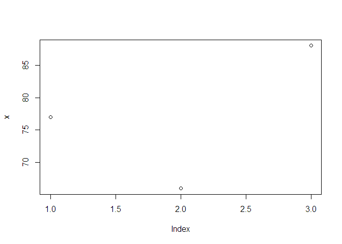<!-- -->

``` r
barplot(x)
```

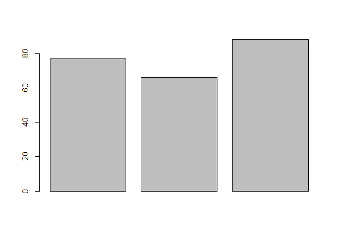<!-- -->

``` r
pie(x)
```

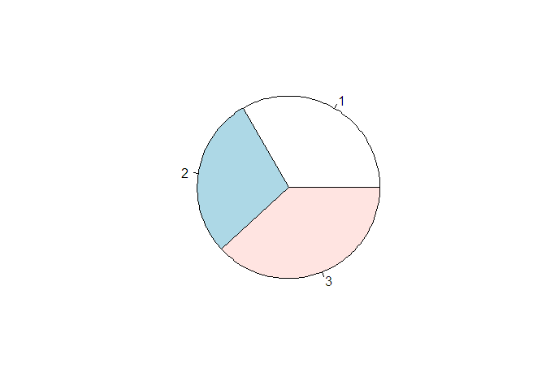<!-- -->

``` r
#' Plot navigation
#' export to the clipboard
#' Publish to http://rpubs.com/

# Demo: RStudio

#' - History
#' - Run from the beginneing
#' - Run to the end
#' - Plot
```

``` r
# Create Shiny Web App

shiny::runApp("Shiny")
shiny::runApp("pk_pd") # PMx_2016
```

``` r
## Examples: ggplot2

library(ggplot2)
qplot(displ, hwy, data = mpg)
```

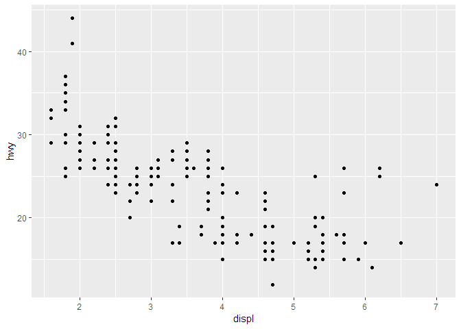<!-- -->

``` r
qplot(displ, hwy, data = mpg, color = drv)
```

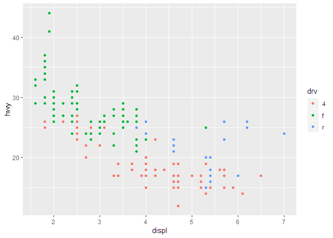<!-- -->

``` r
qplot(displ, hwy, data = mpg, geom = c("point", "smooth"))
```

    ## `geom_smooth()` using method = 'loess' and formula 'y ~ x'

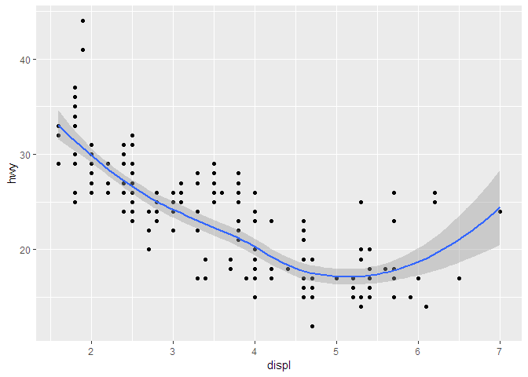<!-- -->

``` r
qplot(hwy, data = mpg, fill = drv)
```

    ## `stat_bin()` using `bins = 30`. Pick better value with `binwidth`.

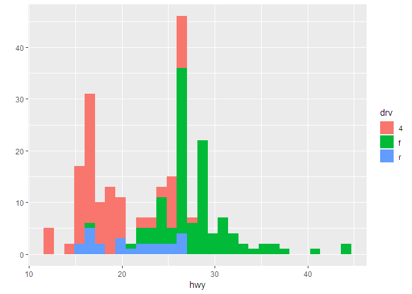<!-- -->

``` r
qplot(displ, hwy, data = mpg, facets = . ~ drv)
```

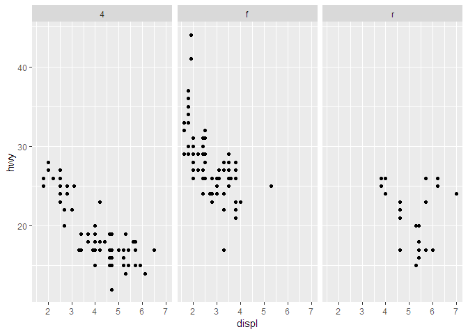<!-- -->

``` r
qplot(hwy, data = mpg, facets = drv ~ ., binwidth = 2)
```

<!-- -->

``` r
maacs <- read.csv("data-raw/maacs.csv", as.is = TRUE)
str(maacs)
```

    ## 'data.frame':    750 obs. of  5 variables:
    ##  $ id       : int  1 2 3 4 5 6 7 8 9 10 ...
    ##  $ eno      : num  141 124 126 164 99 68 41 50 12 30 ...
    ##  $ duBedMusM: num  2423 2793 3055 775 1634 ...
    ##  $ pm25     : num  15.6 34.4 39 33.2 27.1 ...
    ##  $ mopos    : chr  "yes" "yes" "yes" "yes" ...

``` r
# examples of qplot
qplot(log(eno), data = maacs)
```

    ## `stat_bin()` using `bins = 30`. Pick better value with `binwidth`.

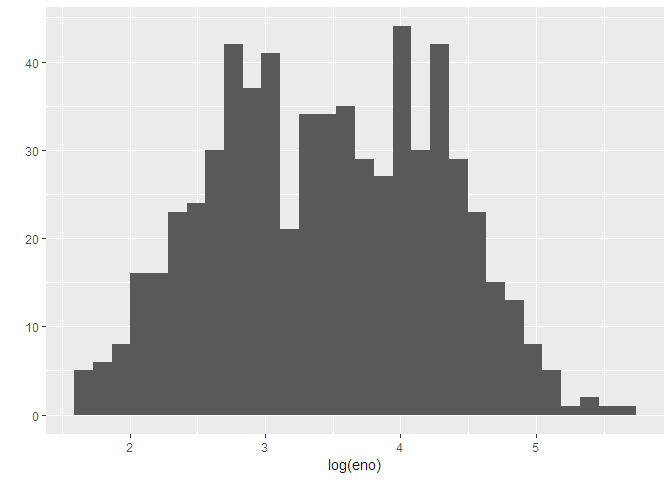<!-- -->

``` r
qplot(log(eno), data = maacs, fill = mopos)
```

    ## `stat_bin()` using `bins = 30`. Pick better value with `binwidth`.

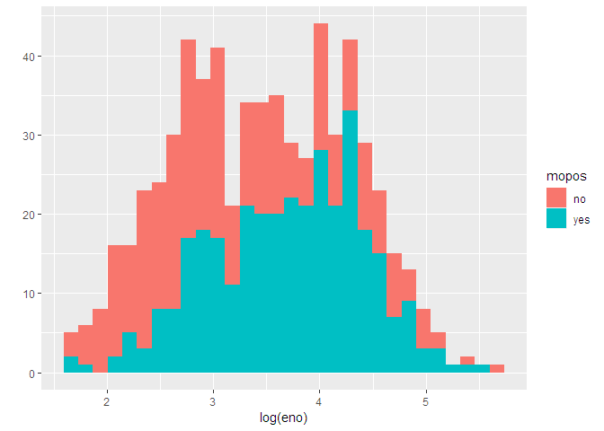<!-- -->

``` r
qplot(log(eno), data = maacs, geom = "density")
```

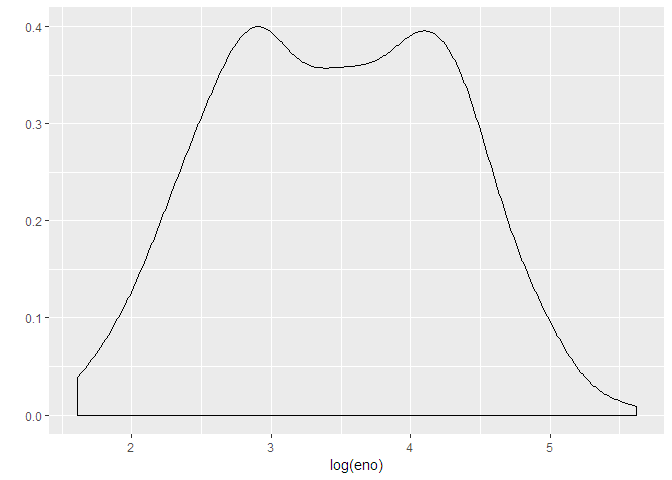<!-- -->

``` r
qplot(log(eno), data = maacs, geom = "density", color = mopos)
```

<!-- -->

``` r
qplot(log(pm25), log(eno), data = maacs)
```

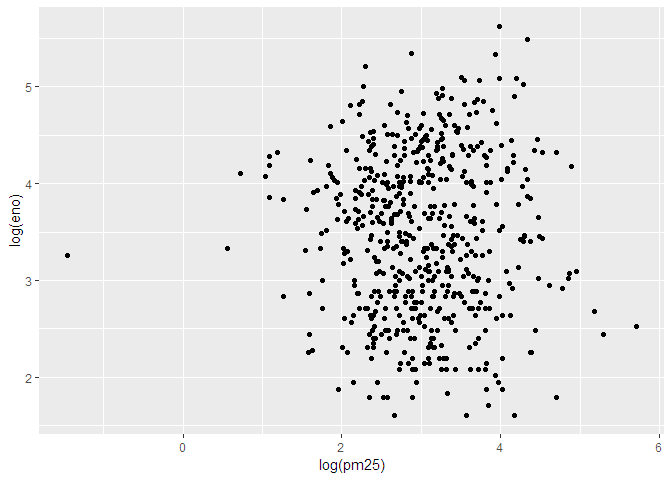<!-- -->

``` r
qplot(log(pm25), log(eno), data = maacs, shape = mopos)
```

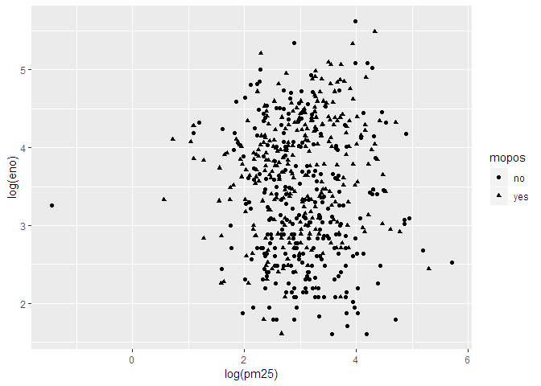<!-- -->

``` r
qplot(log(pm25), log(eno), data = maacs, color = mopos)
```

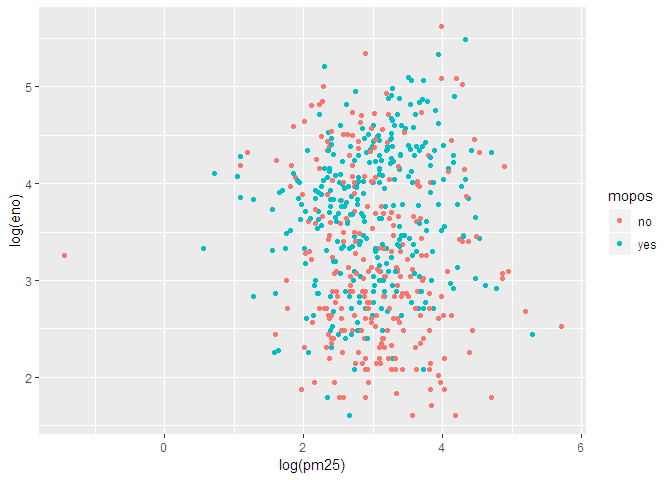<!-- -->

``` r
qplot(log(pm25), log(eno), data = maacs, color = mopos, geom = c("point", "smooth"), method = "lm")
```

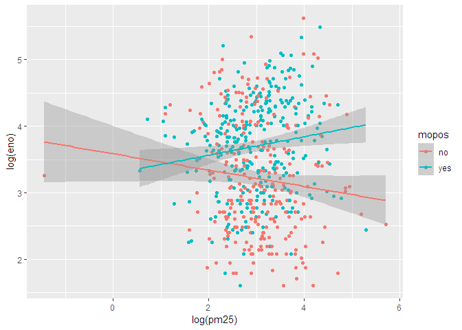<!-- -->

``` r
qplot(log(pm25), log(eno), data = maacs, geom = c("point", "smooth"), methods = "lm", facets = . ~ mopos)
```

    ## `geom_smooth()` using method = 'loess' and formula 'y ~ x'

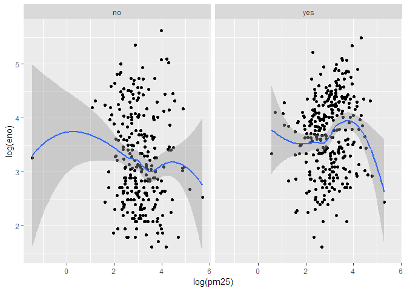<!-- -->

# Session info

``` r
devtools::session_info()
```

    ## - Session info ----------------------------------------------------------
    ##  setting  value                       
    ##  version  R version 3.5.2 (2018-12-20)
    ##  os       Windows 7 x64 SP 1          
    ##  system   x86_64, mingw32             
    ##  ui       RTerm                       
    ##  language (EN)                        
    ##  collate  Korean_Korea.949            
    ##  ctype    Korean_Korea.949            
    ##  tz       Asia/Seoul                  
    ##  date     2019-01-14                  
    ## 
    ## - Packages --------------------------------------------------------------
    ##  package       * version date       lib
    ##  assertthat      0.2.0   2017-04-11 [1]
    ##  backports       1.1.3   2018-12-14 [1]
    ##  bindr           0.1.1   2018-03-13 [1]
    ##  bindrcpp        0.2.2   2018-03-29 [1]
    ##  broom           0.5.1   2018-12-05 [1]
    ##  callr           3.1.1   2018-12-21 [1]
    ##  cellranger      1.1.0   2016-07-27 [1]
    ##  cli             1.0.1   2018-09-25 [1]
    ##  colorspace      1.4-0   2019-01-13 [1]
    ##  crayon          1.3.4   2018-10-25 [1]
    ##  desc            1.2.0   2018-05-01 [1]
    ##  devtools        2.0.1   2018-10-26 [1]
    ##  digest          0.6.18  2018-10-10 [1]
    ##  dplyr         * 0.7.8   2018-11-10 [1]
    ##  evaluate        0.12    2018-10-09 [1]
    ##  flexdashboard * 0.5.1.1 2018-06-29 [1]
    ##  forcats       * 0.3.0   2018-02-19 [1]
    ##  fs              1.2.6   2018-08-23 [1]
    ##  generics        0.0.2   2018-11-29 [1]
    ##  ggplot2       * 3.1.0   2018-10-25 [1]
    ##  ggsci         * 2.9     2018-05-14 [1]
    ##  glue            1.3.0   2018-07-17 [1]
    ##  gtable          0.2.0   2016-02-26 [1]
    ##  haven           2.0.0   2018-11-22 [1]
    ##  hms             0.4.2   2018-03-10 [1]
    ##  htmltools       0.3.6   2017-04-28 [1]
    ##  httpuv          1.4.5.1 2018-12-18 [1]
    ##  httr            1.4.0   2018-12-11 [1]
    ##  jsonlite        1.6     2018-12-07 [1]
    ##  knitr         * 1.21    2018-12-10 [1]
    ##  labeling        0.3     2014-08-23 [1]
    ##  later           0.7.5   2018-09-18 [1]
    ##  lattice         0.20-38 2018-11-04 [1]
    ##  lazyeval        0.2.1   2017-10-29 [1]
    ##  lubridate       1.7.4   2018-04-11 [1]
    ##  magrittr        1.5     2014-11-22 [1]
    ##  memoise         1.1.0   2017-04-21 [1]
    ##  mime            0.6     2018-10-05 [1]
    ##  modelr          0.1.2   2018-05-11 [1]
    ##  munsell         0.5.0   2018-06-12 [1]
    ##  nlme            3.1-137 2018-04-07 [2]
    ##  pillar          1.3.1   2018-12-15 [1]
    ##  pkgbuild        1.0.2   2018-10-16 [1]
    ##  pkgconfig       2.0.2   2018-08-16 [1]
    ##  pkgload         1.0.2   2018-10-29 [1]
    ##  plyr            1.8.4   2016-06-08 [1]
    ##  prettyunits     1.0.2   2015-07-13 [1]
    ##  processx        3.2.1   2018-12-05 [1]
    ##  promises        1.0.1   2018-04-13 [1]
    ##  ps              1.3.0   2018-12-21 [1]
    ##  purrr         * 0.2.5   2018-05-29 [1]
    ##  R6              2.3.0   2018-10-04 [1]
    ##  Rcpp            1.0.0   2018-11-07 [1]
    ##  readr         * 1.3.1   2018-12-21 [1]
    ##  readxl          1.2.0   2018-12-19 [1]
    ##  remotes         2.0.2   2018-10-30 [1]
    ##  reshape2        1.4.3   2017-12-11 [1]
    ##  rlang           0.3.1   2019-01-08 [1]
    ##  rmarkdown     * 1.11    2018-12-08 [1]
    ##  rprojroot       1.3-2   2018-01-03 [1]
    ##  rstudioapi      0.9.0   2019-01-09 [1]
    ##  rvest           0.3.2   2016-06-17 [1]
    ##  scales          1.0.0   2018-08-09 [1]
    ##  sessioninfo     1.1.1   2018-11-05 [1]
    ##  shiny         * 1.2.0   2018-11-02 [1]
    ##  stringi         1.2.4   2018-07-20 [1]
    ##  stringr       * 1.3.1   2018-05-10 [1]
    ##  testthat        2.0.1   2018-10-13 [1]
    ##  tibble        * 2.0.1   2019-01-12 [1]
    ##  tidyr         * 0.8.2   2018-10-28 [1]
    ##  tidyselect      0.2.5   2018-10-11 [1]
    ##  tidyverse     * 1.2.1   2017-11-14 [1]
    ##  usethis         1.4.0   2018-08-14 [1]
    ##  withr           2.1.2   2018-03-15 [1]
    ##  xfun            0.4     2018-10-23 [1]
    ##  xml2            1.2.0   2018-01-24 [1]
    ##  xtable          1.8-3   2018-08-29 [1]
    ##  yaml            2.2.0   2018-07-25 [1]
    ##  source                             
    ##  CRAN (R 3.5.0)                     
    ##  CRAN (R 3.5.1)                     
    ##  CRAN (R 3.5.0)                     
    ##  CRAN (R 3.5.0)                     
    ##  CRAN (R 3.5.1)                     
    ##  CRAN (R 3.5.1)                     
    ##  CRAN (R 3.5.0)                     
    ##  CRAN (R 3.5.1)                     
    ##  CRAN (R 3.5.2)                     
    ##  Github (gaborcsardi/crayon@467939b)
    ##  CRAN (R 3.5.0)                     
    ##  CRAN (R 3.5.1)                     
    ##  CRAN (R 3.5.1)                     
    ##  CRAN (R 3.5.1)                     
    ##  CRAN (R 3.5.1)                     
    ##  CRAN (R 3.5.0)                     
    ##  CRAN (R 3.5.0)                     
    ##  CRAN (R 3.5.1)                     
    ##  CRAN (R 3.5.1)                     
    ##  CRAN (R 3.5.1)                     
    ##  CRAN (R 3.5.0)                     
    ##  CRAN (R 3.5.1)                     
    ##  CRAN (R 3.5.0)                     
    ##  CRAN (R 3.5.1)                     
    ##  CRAN (R 3.5.0)                     
    ##  CRAN (R 3.5.0)                     
    ##  CRAN (R 3.5.1)                     
    ##  CRAN (R 3.5.1)                     
    ##  CRAN (R 3.5.1)                     
    ##  CRAN (R 3.5.1)                     
    ##  CRAN (R 3.5.0)                     
    ##  CRAN (R 3.5.1)                     
    ##  CRAN (R 3.5.1)                     
    ##  CRAN (R 3.5.0)                     
    ##  CRAN (R 3.5.2)                     
    ##  CRAN (R 3.5.0)                     
    ##  CRAN (R 3.5.0)                     
    ##  CRAN (R 3.5.1)                     
    ##  CRAN (R 3.5.0)                     
    ##  CRAN (R 3.5.0)                     
    ##  CRAN (R 3.5.2)                     
    ##  CRAN (R 3.5.1)                     
    ##  CRAN (R 3.5.1)                     
    ##  CRAN (R 3.5.1)                     
    ##  CRAN (R 3.5.1)                     
    ##  CRAN (R 3.5.0)                     
    ##  CRAN (R 3.5.0)                     
    ##  CRAN (R 3.5.1)                     
    ##  CRAN (R 3.5.0)                     
    ##  CRAN (R 3.5.1)                     
    ##  CRAN (R 3.5.0)                     
    ##  CRAN (R 3.5.1)                     
    ##  CRAN (R 3.5.1)                     
    ##  CRAN (R 3.5.1)                     
    ##  CRAN (R 3.5.1)                     
    ##  CRAN (R 3.5.1)                     
    ##  CRAN (R 3.5.0)                     
    ##  CRAN (R 3.5.2)                     
    ##  CRAN (R 3.5.1)                     
    ##  CRAN (R 3.5.0)                     
    ##  CRAN (R 3.5.2)                     
    ##  CRAN (R 3.5.0)                     
    ##  CRAN (R 3.5.1)                     
    ##  CRAN (R 3.5.1)                     
    ##  CRAN (R 3.5.1)                     
    ##  CRAN (R 3.5.1)                     
    ##  CRAN (R 3.5.0)                     
    ##  CRAN (R 3.5.1)                     
    ##  CRAN (R 3.5.2)                     
    ##  CRAN (R 3.5.1)                     
    ##  CRAN (R 3.5.1)                     
    ##  CRAN (R 3.5.1)                     
    ##  CRAN (R 3.5.1)                     
    ##  CRAN (R 3.5.0)                     
    ##  CRAN (R 3.5.1)                     
    ##  CRAN (R 3.5.0)                     
    ##  CRAN (R 3.5.1)                     
    ##  CRAN (R 3.5.1)                     
    ## 
    ## [1] C:/Users/mdlhs/Rlib
    ## [2] C:/Program Files/R/R-3.5.2/library
