R programming Week 9
================
Sungpil Han

2017년 1학기 강의용으로 만든 자료입니다.

``` r
knitr::opts_chunk$set(error = TRUE, warning = FALSE)

Week09 <- c("tidyverse", "shiny", "dplyr", "ggplot2", "rmarkdown", "knitr", "flexdashboard", "ggsci") #install.packages(Week09)
LibraryWeek09 <- lapply(Week09, library, character.only = TRUE)
```

    ## ── Attaching packages ────────────────────────────────── tidyverse 1.2.1 ──

    ## ✔ ggplot2 3.0.0     ✔ purrr   0.2.5
    ## ✔ tibble  1.4.2     ✔ dplyr   0.7.6
    ## ✔ tidyr   0.8.1     ✔ stringr 1.3.1
    ## ✔ readr   1.1.1     ✔ forcats 0.3.0

    ## ── Conflicts ───────────────────────────────────── tidyverse_conflicts() ──
    ## ✖ dplyr::filter() masks stats::filter()
    ## ✖ dplyr::lag()    masks stats::lag()

``` r
#assign data to a variable
x <- c(77, 66, 88)
mean(x)
```

    ## [1] 77

``` r
max(x)
```

    ## [1] 88

``` r
#charts
plot(x)
```


``` r
barplot(x)
```


``` r
pie(x)
```

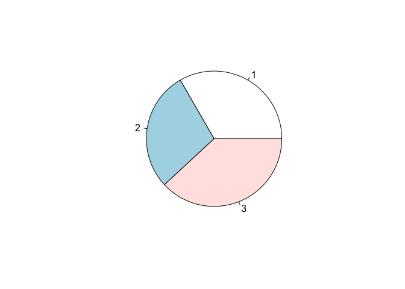

``` r
#' Plot navigation
#' export to the clipboard
#' Publish to http://rpubs.com/

# Demo: RStudio

#' - History
#' - Run from the beginneing
#' - Run to the end
#' - Plot
```

``` r
# Create Shiny Web App

shiny::runApp("Shiny")
shiny::runApp("pk_pd") # PMx_2016
```

``` r
## Examples: ggplot2

library(ggplot2)
qplot(displ, hwy, data = mpg)
```

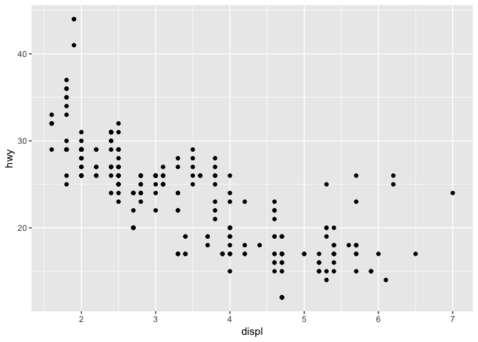

``` r
qplot(displ, hwy, data = mpg, color = drv)
```

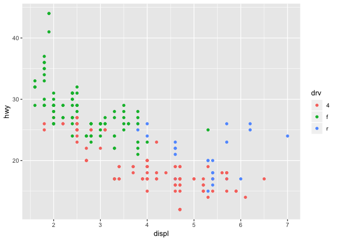

``` r
qplot(displ, hwy, data = mpg, geom = c("point", "smooth"))
```

    ## `geom_smooth()` using method = 'loess' and formula 'y ~ x'

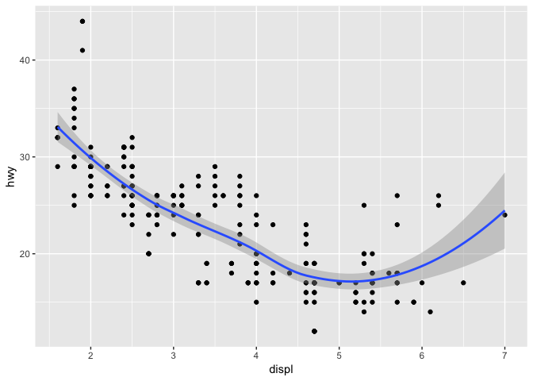

``` r
qplot(hwy, data = mpg, fill = drv)
```

    ## `stat_bin()` using `bins = 30`. Pick better value with `binwidth`.

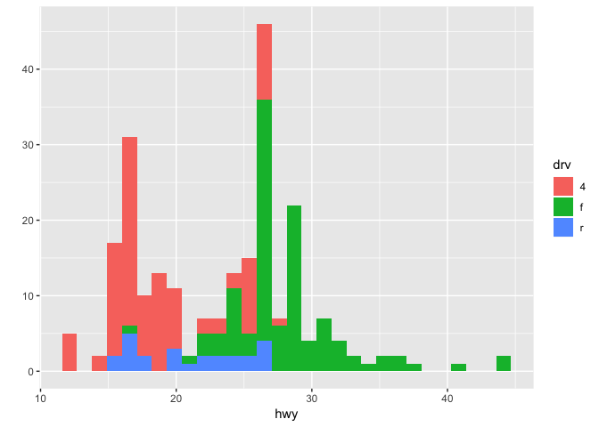

``` r
qplot(displ, hwy, data = mpg, facets = . ~ drv)
```

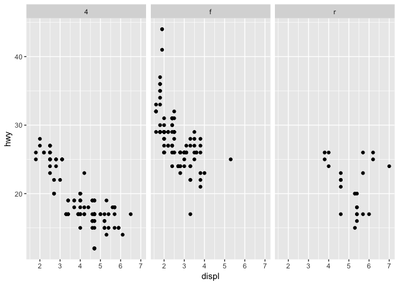

``` r
qplot(hwy, data = mpg, facets = drv ~ ., binwidth = 2)
```

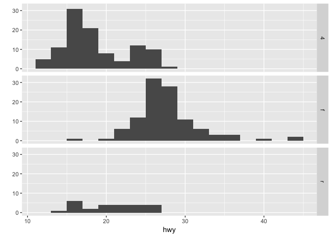

``` r
maacs <- read.csv("data-raw/maacs.csv", as.is = TRUE)
str(maacs)
```

    ## 'data.frame':    750 obs. of  5 variables:
    ##  $ id       : int  1 2 3 4 5 6 7 8 9 10 ...
    ##  $ eno      : num  141 124 126 164 99 68 41 50 12 30 ...
    ##  $ duBedMusM: num  2423 2793 3055 775 1634 ...
    ##  $ pm25     : num  15.6 34.4 39 33.2 27.1 ...
    ##  $ mopos    : chr  "yes" "yes" "yes" "yes" ...

``` r
# examples of qplot
qplot(log(eno), data = maacs)
```

    ## `stat_bin()` using `bins = 30`. Pick better value with `binwidth`.

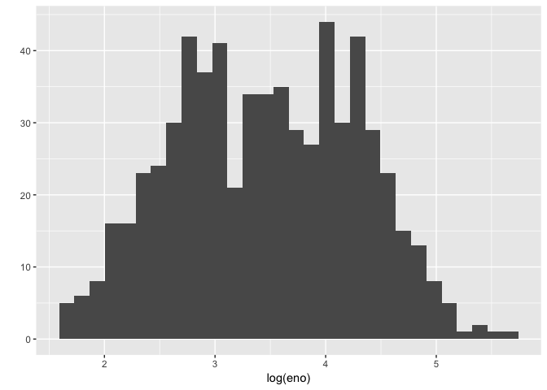

``` r
qplot(log(eno), data = maacs, fill = mopos)
```

    ## `stat_bin()` using `bins = 30`. Pick better value with `binwidth`.

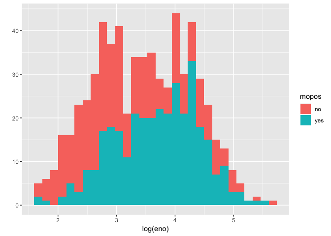

``` r
qplot(log(eno), data = maacs, geom = "density")
```

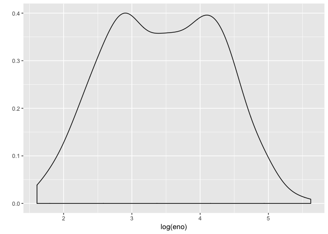

``` r
qplot(log(eno), data = maacs, geom = "density", color = mopos)
```

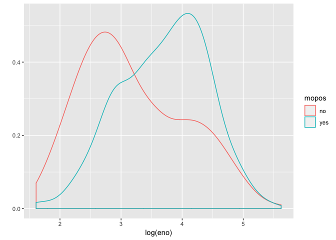

``` r
qplot(log(pm25), log(eno), data = maacs)
```

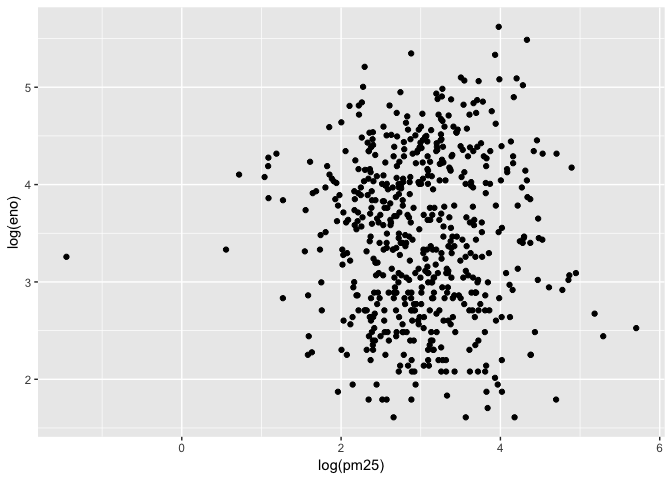

``` r
qplot(log(pm25), log(eno), data = maacs, shape = mopos)
```

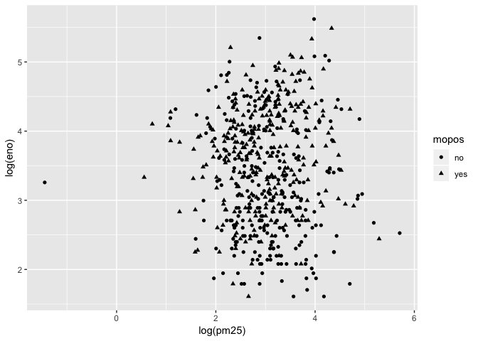

``` r
qplot(log(pm25), log(eno), data = maacs, color = mopos)
```

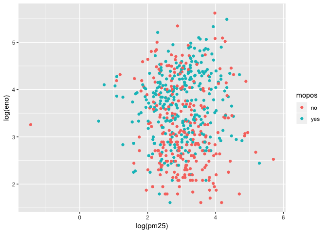

``` r
qplot(log(pm25), log(eno), data = maacs, color = mopos, geom = c("point", "smooth"), method = "lm")
```

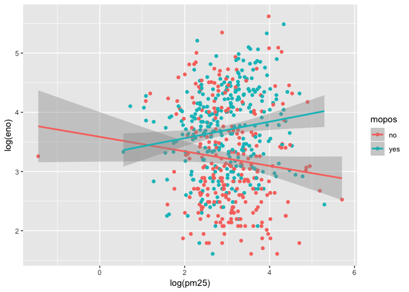

``` r
qplot(log(pm25), log(eno), data = maacs, geom = c("point", "smooth"), methods = "lm", facets = . ~ mopos)
```

    ## `geom_smooth()` using method = 'loess' and formula 'y ~ x'

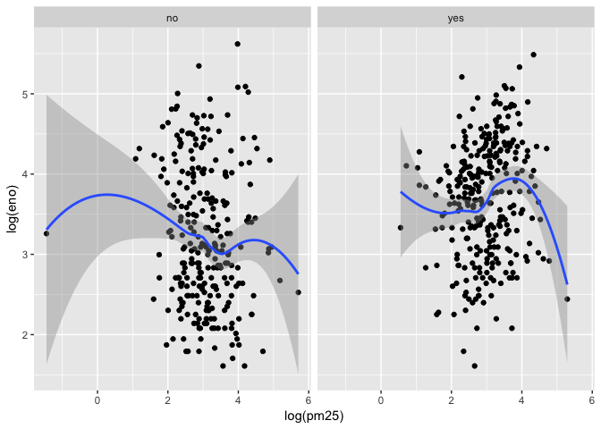

Session info
============

``` r
devtools::session_info()
```

    ## Session info -------------------------------------------------------------

    ##  setting  value                       
    ##  version  R version 3.5.1 (2018-07-02)
    ##  system   x86_64, darwin17.6.0        
    ##  ui       unknown                     
    ##  language (EN)                        
    ##  collate  C                           
    ##  tz       Asia/Seoul                  
    ##  date     2018-07-13

    ## Packages -----------------------------------------------------------------

    ##  package       * version date       source        
    ##  assertthat      0.2.0   2017-04-11 CRAN (R 3.5.0)
    ##  backports       1.1.2   2017-12-13 CRAN (R 3.5.0)
    ##  base          * 3.5.1   2018-07-03 local         
    ##  bindr           0.1.1   2018-03-13 CRAN (R 3.5.0)
    ##  bindrcpp        0.2.2   2018-03-29 CRAN (R 3.5.0)
    ##  broom           0.4.5   2018-07-03 CRAN (R 3.5.1)
    ##  cellranger      1.1.0   2016-07-27 CRAN (R 3.5.0)
    ##  cli             1.0.0   2017-11-05 CRAN (R 3.5.0)
    ##  colorspace      1.3-2   2016-12-14 CRAN (R 3.5.0)
    ##  compiler        3.5.1   2018-07-03 local         
    ##  crayon          1.3.4   2017-09-16 CRAN (R 3.5.0)
    ##  datasets      * 3.5.1   2018-07-03 local         
    ##  devtools        1.13.6  2018-06-27 CRAN (R 3.5.0)
    ##  digest          0.6.15  2018-01-28 CRAN (R 3.5.0)
    ##  dplyr         * 0.7.6   2018-06-29 CRAN (R 3.5.0)
    ##  evaluate        0.10.1  2017-06-24 CRAN (R 3.5.0)
    ##  flexdashboard * 0.5.1.1 2018-06-29 CRAN (R 3.5.0)
    ##  forcats       * 0.3.0   2018-02-19 CRAN (R 3.5.0)
    ##  foreign         0.8-70  2017-11-28 CRAN (R 3.5.1)
    ##  ggplot2       * 3.0.0   2018-07-03 CRAN (R 3.5.1)
    ##  ggsci         * 2.9     2018-05-14 CRAN (R 3.5.0)
    ##  glue            1.2.0   2017-10-29 CRAN (R 3.5.0)
    ##  graphics      * 3.5.1   2018-07-03 local         
    ##  grDevices     * 3.5.1   2018-07-03 local         
    ##  grid            3.5.1   2018-07-03 local         
    ##  gtable          0.2.0   2016-02-26 CRAN (R 3.5.1)
    ##  haven           1.1.2   2018-06-27 CRAN (R 3.5.0)
    ##  hms             0.4.2   2018-03-10 CRAN (R 3.5.0)
    ##  htmltools       0.3.6   2017-04-28 CRAN (R 3.5.0)
    ##  httpuv          1.4.4.2 2018-07-02 CRAN (R 3.5.0)
    ##  httr            1.3.1   2017-08-20 CRAN (R 3.5.0)
    ##  jsonlite        1.5     2017-06-01 CRAN (R 3.5.0)
    ##  knitr         * 1.20    2018-02-20 CRAN (R 3.5.0)
    ##  labeling        0.3     2014-08-23 CRAN (R 3.5.0)
    ##  later           0.7.3   2018-06-08 CRAN (R 3.5.0)
    ##  lattice         0.20-35 2017-03-25 CRAN (R 3.5.1)
    ##  lazyeval        0.2.1   2017-10-29 CRAN (R 3.5.0)
    ##  lubridate       1.7.4   2018-04-11 CRAN (R 3.5.0)
    ##  magrittr        1.5     2014-11-22 CRAN (R 3.5.0)
    ##  memoise         1.1.0   2017-04-21 CRAN (R 3.5.0)
    ##  methods       * 3.5.1   2018-07-03 local         
    ##  mime            0.5     2016-07-07 CRAN (R 3.5.0)
    ##  mnormt          1.5-5   2016-10-15 CRAN (R 3.5.0)
    ##  modelr          0.1.2   2018-05-11 CRAN (R 3.5.0)
    ##  munsell         0.5.0   2018-06-12 CRAN (R 3.5.0)
    ##  nlme            3.1-137 2018-04-07 CRAN (R 3.5.1)
    ##  parallel        3.5.1   2018-07-03 local         
    ##  pillar          1.2.3   2018-05-25 CRAN (R 3.5.0)
    ##  pkgconfig       2.0.1   2017-03-21 CRAN (R 3.5.0)
    ##  plyr            1.8.4   2016-06-08 CRAN (R 3.5.0)
    ##  promises        1.0.1   2018-04-13 CRAN (R 3.5.0)
    ##  psych           1.8.4   2018-05-06 CRAN (R 3.5.0)
    ##  purrr         * 0.2.5   2018-05-29 CRAN (R 3.5.0)
    ##  R6              2.2.2   2017-06-17 CRAN (R 3.5.0)
    ##  Rcpp            0.12.17 2018-05-18 CRAN (R 3.5.0)
    ##  readr         * 1.1.1   2017-05-16 CRAN (R 3.5.0)
    ##  readxl          1.1.0   2018-04-20 CRAN (R 3.5.0)
    ##  reshape2        1.4.3   2017-12-11 CRAN (R 3.5.0)
    ##  rlang           0.2.1   2018-05-30 CRAN (R 3.5.0)
    ##  rmarkdown     * 1.10    2018-06-11 CRAN (R 3.5.0)
    ##  rprojroot       1.3-2   2018-01-03 CRAN (R 3.5.0)
    ##  rstudioapi      0.7     2017-09-07 CRAN (R 3.5.0)
    ##  rvest           0.3.2   2016-06-17 CRAN (R 3.5.0)
    ##  scales          0.5.0   2017-08-24 CRAN (R 3.5.0)
    ##  shiny         * 1.1.0   2018-05-17 CRAN (R 3.5.0)
    ##  stats         * 3.5.1   2018-07-03 local         
    ##  stringi         1.2.3   2018-06-12 CRAN (R 3.5.0)
    ##  stringr       * 1.3.1   2018-05-10 CRAN (R 3.5.0)
    ##  tibble        * 1.4.2   2018-01-22 CRAN (R 3.5.0)
    ##  tidyr         * 0.8.1   2018-05-18 CRAN (R 3.5.0)
    ##  tidyselect      0.2.4   2018-02-26 CRAN (R 3.5.0)
    ##  tidyverse     * 1.2.1   2017-11-14 CRAN (R 3.5.0)
    ##  tools           3.5.1   2018-07-03 local         
    ##  utils         * 3.5.1   2018-07-03 local         
    ##  withr           2.1.2   2018-03-15 CRAN (R 3.5.0)
    ##  xml2            1.2.0   2018-01-24 CRAN (R 3.5.0)
    ##  xtable          1.8-2   2016-02-05 CRAN (R 3.5.0)
    ##  yaml            2.1.19  2018-05-01 CRAN (R 3.5.0)
